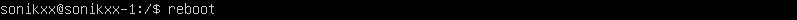
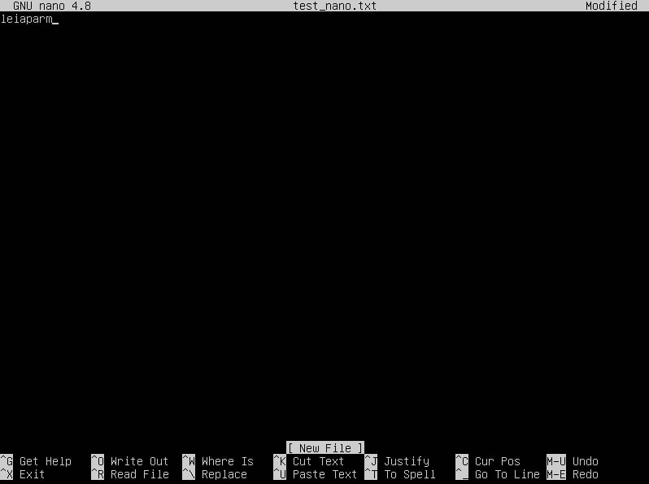
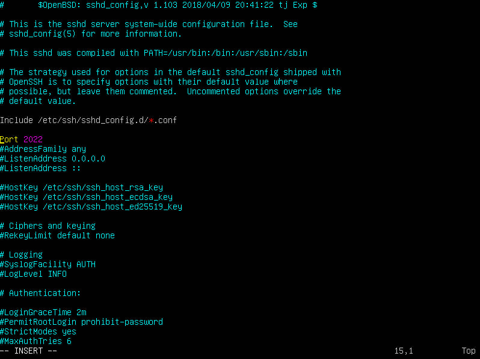
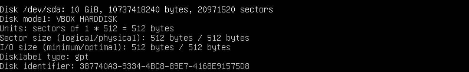
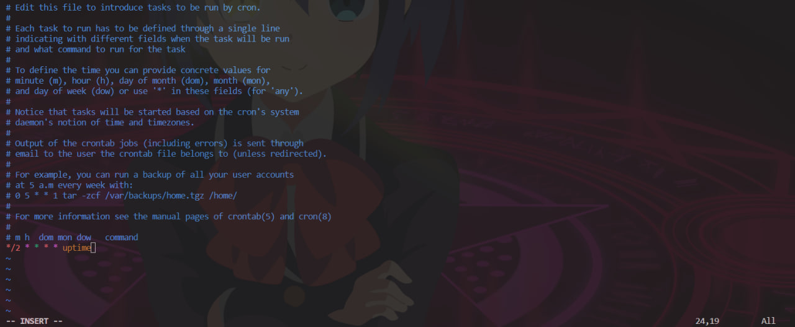
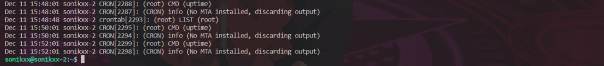
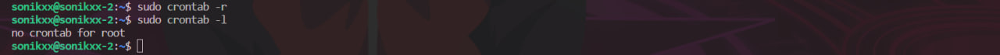

## Part1. Installation of the OS
* Узнаем версию Ubuntu с помощью команды cat /etc/issue  

## Part2. Creating a user
* Команда для создания пользователя my_leiaparm и добавление его в группу adm  
  
* Новый пользователь должен быть в выводе команды cat /etc/passwd  
  

## Part3. Setting up the OS network
* Задаем название машины вида user-1, используя команду hostnamectl  
  
* Редактируем файл /etc/hosts в vi   
  
* После перезагрузки мы видим, что hostname было изменено  
  
* С помощью команды sudo timedatectl с опцией set-timezone изменяем часовой пояс на Europe/Moscow  
  
* Используя команду ifconfig с флагом -a выводим информацию обо всех активных или неактивных сетевых интерфейсах на сервере  
  
* lo (loopback device) – виртуальный интерфейс, присутствующий по умолчанию в любом Linux. Он используется для отладки сетевых программ и запуска серверных приложений на локальной машине. С этим интерфейсом всегда связан адрес 127.0.0.1.  
* Получим ip адрес устройства, на котором мы работаем, от DHCP сервера, с помощью команды hostname с флагом -I  
  
* или ту же информацию можно получить с помощью dhcpclient  
  
* DHCP - Dynamic Host Configuration Protocol (протокол динамической настройки узла) 
* Выведем на экран внешний ip-адрес шлюза 
  
* Выведем на экран внутренний IP-адрес шлюза, он же ip-адрес по умолчанию   
  
* Зададим статичные (заданные вручную) настройки ip, gw, dns. Сначала открываем файл конфигурации Netplan  
  
* Указываем статический IP адрес сервера в разделе addresses и в разделе nameservers указывается DNS Google, который имеет адрес 8.8.8.8  
  
* Чтобы применить внесенные изменения, выполним команду sudo netplan apply  
  
* Перезагрузим виртуальную машину с помощью команды reboot  
  
* Убедимся, что статичные сетевые настройки (ip, gw, dns) соответствуют заданным в предыдущем пункте с помощью команды ifconfig  
  
* Успешно пропингованы удаленные хосты 1.1.1.1 и ya.ru, в выводе команды должна быть фраза "0% packet loss"  
  

## Part4. OS Update
* Обновляем системные пакеты до последней на момент выполнения задания версии с помощью команд apt update и apt upgrade  
  
* Вывод команды apt upgrade после обновления показывает, что обновления отсутсвуют  
  

## Part5. Using the sudo command
* Разрешить пользователю my_leiaparm выполнять команду sudo  
 
* sudo – это утилита для операционных систем семейства Linux, позволяющая пользователю запускать программы с привилегиями другой учётной записи, как правило, суперпользователя.  
* Поменяем hostname ОС от имени пользователя my_leiaparm (используя sudo), для этого сначала поменяем пользователя с помощью команды su  
  
* А теперь используя команды из part3 поменяем имя хоста ОС на sonikxx-2  
  

## Part6. Installing and configuring the time service
* Выведем время, часового пояса, в котором я сейчас нахожусь, используя команду date  
  
* Вывод команды timedatectl show содержит NTPSynchronized=yes:  
  

## Part7. Installing and using text editors
* Выход с сохранением из файла test_X.txt, где X-название редактора, в котором создан файл. 
* VIM. Чтобы выйти с сохранением изменений из vim сначала необходимо нажать "Esc" для выхода в "командный режим", вводим ":", далее вводим "wq" (write-quit) и нажимаем "Enter"  
  
* NANO. Для выхода с сохранением из nano надо нажать CTRL + O для сохранения (после чего нажать Enter для перезаписи текущего открытого файла), а потом CTRL + X для выхода   
  
* MCEDIT. Для выхода с сохранением из mcedit надо нажать F2 для сохранения, а потом F10 для выхода   
  
* Выход без сохранения изменений, после того как в файле заменили никнейм на строку "33 abc 33"  
* VIM. Чтобы выйти без сохранения изменений из vim сначала необходимо нажать "Esc" для выхода в "командный режим", вводим ":", далее вводим "q!" и нажимаем "Enter"  
  
* NANO. Чтобы выйти без сохранения изменений из nano сначала необходимо нажать CTRL + X, при этом он спросит, не хотите ли вы сохранить изменения, на что надо ответить N 
  
* MCEDIT. Чтобы выйти без сохранения изменений из mcedit сначала необходимо нажать F10, при этом он спросит, не хотите ли вы сохранить изменения, на что надо ответить N 
  
* Отредактируем файл ещё раз, а затем выполним функции поиска по содержимому файла (слово) и замены слова на любое другое  
* VIM. Для поиска слова в vim необходимо перейти в начало файла и нажать "/", после чего можно вписать слово для поиска  
  
* NANO. Для поиска слова в nano необходимо нажать CTRL + W (от английского "WhereIs"), ввести слово для поиска и нажать "Enter"  
  
* MCEDIT. Для поиска слова в mcedit необходимо нажать F7, ввести слово для поиска, выбрать дополнительные параметры поиска и нажать "Enter"  
  
* VIM. Для замены слова на любое другое в vim сначала вводим ":", чтобы заменить во всем файле используем "%s", далее через "/" следует слово, которое будем заменять, а после него снова через "/" слово, на которое заменяем, также могут быть использованы дополнительные флаги  
  
* NANO. Для замены слова на любое другое в nano сначала используем сочетание клавиш CTRL +W для перехода к панели поиска, далее нажимаем CTRL + R. Теперь можно вводить часть текста, которую хотим удалить, и нажимаем "Enter"  
  
* После этого вводим слово, которое должно быть на месте старого фрагмента текста, и если хотим заменить все найденные слова, то выбираем "Y"  
  
* MCEDIT. Для замены слова на любое другое в mcedit сначала нажимаем F4, вводим строку, которую будем заменять в тексте, далее строку, на которую будем заменять, также можно ввести дополнительные параметры  
  
* После этого необходимо будет подтвердить замену 
  

## Part8. Installing and basic setup of the SSHD service
* Установиv службу SSHd, с помощью команд sudo apt-get install ssh и sudo apt install openssh-server  
  
* Добавим автостарт службы при загрузке системы с помощью команды sudo systemctl enable ssh  
  
* Чтобы проверить, используем sudo systemctl status ssh, в выводе команды enabled — подтверждает то, что служба будет запущена после рестарта  
  
* Перенастроим службу SSHd на порт 2022, сначала проверим, что порт 2022 свободный, а потом отредактируем файл /etc/ssh/sshd_config  
  
* В этом файле запишем "Port 2022" и сохраним 
  
* Теперь перезапустим ssh, с помощью команды sudo systemctl restart sshd, и проверим, что мы смогли поменять порт, используя sudo netstat -tan 
  
* Значения флагов:  
-t - выводит активные TCP соединения  
-a - выводит информацию о всех сокетах(об активных которые слушают порты и неактивных, которые не слушают).  
-n - показывает сетевые адреса как числа. Netstat обычно показывает адреса как символы. Эту опцию можно использовать с любым форматом показа.  
Теперь обьясним значение каждого столбца: 
Proto - протокол (tcp, udp, raw), используемый сокетом  
Recv-Q - счётчик байт не скопированных программой пользователя из этого сокета (количество полученных пакетов в очереди)  
Send-Q - счётчик байтов, не подтверждённых удалённым узлом (количество отправленных пакетов в очереди)  
Local Address - адрес и номер порта локального конца сокета. Если не указана опция --numeric (-n), адрес сокета преобразуется каноническое имя узла (FQDN), и номер порта преобразуется в соответствующее имя службы (адрес локальной машины и порта)  
Foreign Address - адрес и номер порта удалённого конца сокета. Аналогично "Local Address." (адрес удаленного компьютера и порта)  
State - состояние сокета. LISTEN	означает, что сокет ожидает входящих подключений  
В этом выводе 0.0.0.0 представляет любые доступные IP-адреса этого компьютера. Это может быть IP-адрес сетевой карты или 127.0.0.1. 
* Используя команду ps -A | grep sshd, покажем наличие процесса sshd  
  
* Команда ps выдает информацию об активных процессах.  
* Значения флагов:  
-A (-a) - вывести информацию обо всех процессах  
-d - вывести информацию обо всех процессах, кроме лидеров групп  
-f - генерировать полный листинг  
-p - выбрать процессы PID  
-r - просмотреть все работающие (running) процессы  
-U 'userlist' - найти все процессы, выполняемые конкретным пользователем  
-v - вывести процессы, выполнение которых отнимает у процессора больше всего времени  
* Перезагрузим систему с помощью команды reboot и проверим, что порт все также имеет значение 2022  
  

## Part9. Installing and using the top, htop utilities
* Установим и запустим команду top  
  
* По выводу команды мы можем узнать:  
-uptume 1:09 min - продолжительность работы системы с момента запуска 
-количество авторизованных пользователей 1  
-общая загрузка системы 0.0 0.0 0.0 - Load Average за последние 1 минуту, 5 минут и 15 минут, показатель средней загруженности системы  
-общее количество процессов 95  
-загрузка cpu 0.0 us (процент использования центрального процессора пользовательскими процессам), 0.3 sy (процент использования центрального процессора системными процессами), 0.0 ni (процент использования центрального процессора процессами с приоритетом, повышенным при помощи вызова), 99.7 id ( процент времени, когда центральный процессор не используется), 0.0 wa (процент использования центрального процессора процессами, ожидающими завершения операций ввода-вывода), 0.0 hi (процент использования центрального процессора обработчиками аппаратных прерываний), 0.0 si (роцент использования центрального процессора обработчиками программных прерываний), 0.0 st (количество ресурсов центрального процессора "заимствованных" у виртуальной машины гипервизором для других задач) 
-загрузка памяти 3071.6 total (общее количество памяти), 2554.4 free (количество свободной памяти), 137.6 used (количество используемой памяти), 379.5 buff/cache (количество памяти в кэше буферов) 
-pid процесса занимающего больше всего памяти 659?,  для того, чтобы отсортировать процессы по времени необходимо нажать SHIFT + M во время вызова команды top  
-pid процесса, занимающего больше всего процессорного времени 1541, для того, чтобы отсортировать процессы по времени необходимо нажать SHIFT + T внутри вызова команды top  
* Установим и запустим команду htop  
* Отсортируем вывод команды по PID, используем клавишу F6 для выбора поля, которое будем использовать для сортировки 
  
* Отсортируем вывод команды по PERCENT_CPU  
  
* Отсортируем вывод команды по PERCENT_MEM  
  
* Отсортируем вывод команды по TIME  
  
* Вывод команды htop отфильтрованный для процесса sshd, для записи фильтра необходимо нажать F4  
  
* Вывод команды htop с процессом syslog, найденным через поиск, используем F3  
  
* Вывод команды htop с добавленным выводом hostname, clock и uptime с помощью меню Setup  
  

## Part10. Using the fdisk utility
* Запустим команду fdisk -l  
  
* Название жесткого диска - VBOX HARDDISK  
* Размер жесткого диска - 10 GiB 
* Количество секторов - 20971520 
* Размер swap (пространство подкачки) отстутсвует, потому что файл подкачки не создавался (эту же информацию можно увидеть на скриншоте вызова htop)  

## Part11. Using the df utility
* Запустим команду df  
  
* По выводу команды для корневого раздела (/) мы можем определить:  
* размер раздела - 8408452  
* размер занятого пространства - 2729932  
* размер свободного пространства - 5229804  
* процент использования - 35%  
* Единица измерения в выводе - килобайт. По умолчанию, количество места на дисках выводится в килобайтах, если не указан какой-либо ключ  
* Запустим команду df -Th  
  
* По выводу команды для корневого раздела (/) мы можем определить:  
* размер раздела - 8.1G  
* размер занятого пространства - 2.7G  
* размер свободного пространства - 5.0G  
* процент использования - 35%  
* Тип файловой системы - ext4  

## Part12. Using the du utility
* Запустим команду du  
  
* Выведем размер папок /home, /var, /var/log в байтах, для этого достаточно добавить флаг -s, так мы получим общий размер директории  
  
* Чтобы вывести в человекочитаемом виде, достаточно добавить флаг -h  
  
* Выведем размер всего содержимого в /var/log, для этого можно использовать флаг -a, который отображает использование диска всеми файлами, а не только каталогами  
  
* Продолжение вывода  
  

## Part13. Installing and using the ncdu utility
* Установим утилиту ncdu и запустим  
  
* Выведем размер папки /home, значение совпадает с предыдущим пунктом  
  
* Выведем размер папки /var, значение примерно совпадает с предыдущим пунктом  
  
* Выведем размер папки /var/log, значение совпадает с предыдущим пунктом  
  

## Part14. Working with system logs
* Откроем для просмотра /var/log/auth.log и с помощью grep сможем найти последнюю успешную авторизацию  
  
* Время последней успешной авторизации - Dec 11 15:14:53 
* Имя пользователя - sonikxx  
* Метод входа в систему - paw_unix 
* Перезапустим службу SSHd с помощью команды sudo systemctl restart ssh и найдем в файле /var/log/syslog сообщение о рестарте службы 
  

## Part15. Using the CRON job scheduler
* Используя планировщик заданий, запустим команду uptime через каждые 2 минуты. Синтаксис настройки одной задачи cron: минута час день месяц день_недели /путь/к/исполняемому/файлу. Для редактрования списка заданий необходимо выполнить команду sudo crontab -e, так как запускать uptime необходимо через каждые 2 секунды, прописывать 2, 4, 6, ..., 60 будет достаточно долго, поэтому используем /2
  
* Найдем в системном журнале /var/log/syslog строчки о выполнении команды 
  
* Выведем на экран список текущих заданий для CRON с помощью команды sudo crontab -l  
  
* Удалим все задания из планировщика заданий с помощью команды sudo crontab -r и проверим список текущих заданий для CRON  
  
