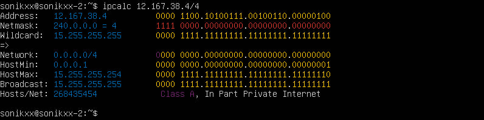
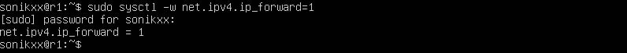
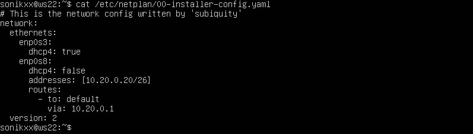
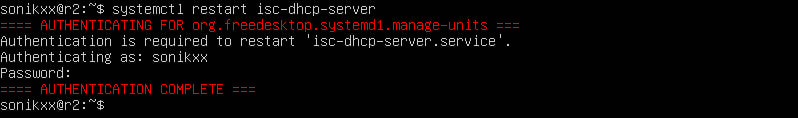
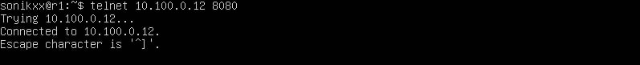

## Part1. Инструмент ipcalc
### 1.1. Сети и маски
* Адрес сети 192.167.38.54/13 - 192.160.0.0  
  

* Перевод маски 255.255.255.0 в префиксную запись - /24 и двоичную запись - 11111111.11111111.11111111.00000000  
  
Перевод /15 в обычную запись - 255.254.0.0 и двоичную запись - 11111111.11111110.00000000.00000000  
  
Перевод 11111111.11111111.11111111.11110000 в обычную запись - 255.255.255.240 и префиксную запись - /28 
  

* Минимальный и максимальный хост в сети 12.167.38.4:  
при маске /8 минимальный хост - 12.0.0.1 и максимальный хост - 12.255.255.254  
  
при маске 11111111.11111111.00000000.00000000 минимальный хост - 12.167.0.1 и максимальный хост - 12.167.255.254  
  
при маске 255.255.254.0 минимальный хост - 12.167.38.1 и максимальный хост - 12.167.39.254  
  
при маске /4 минимальный хост - 0.0.0.1 и максимальный хост - 15.255.255.254  
  

### 1.2. localhost
* Определить, можно ли обратиться к приложению, работающему на localhost, с IP: 194.34.23.100, 127.0.0.2, 127.1.0.1, 128.0.0.1. Диапазон IP-адресов, которые предназначены для создания локальных сетей 127.0.0.1 - 127.255.255.255. поэтому к 194.34.23.100 и 128.0.0.1 обратиться нельзя, а к 127.0.0.2 и 127.1.0.1 - можно 

### 1.3. Диапазоны и сегменты сетей
* Какие из перечисленных IP можно использовать в качестве публичного, а какие только в качестве частных: 10.0.0.45, 134.43.0.2, 192.168.4.2, 172.20.250.4, 172.0.2.1, 192.172.0.1, 172.68.0.2, 172.16.255.255, 10.10.10.10, 192.169.168.1  
К частным IP адресам относятся частные сети 10.0.0.0 с маской подсети 255.0.0.0 
  
К частным IP адресам относятся частные сети 172.16.0.0-172.31.0.0 с маской подсети 255.240.0.0 
  
К частным IP адресам относятся частные сети 192.168.0.0 с маской подсети 255.255.0.0 
  
Поэтому из списка IP адресов в качестве публичного можно использовать: 134.43.0.2, 172.0.2.1, 192.172.0.1, 172.68.0.2, 192.169.168.1; а в качестве частного: 10.0.0.45, 192.168.4.2, 172.20.250.4, 172.16.255.255, 10.10.10.10. Также этот результат можно проверить при помощи ipcalc, публичным IP адресам будет присвоен класс сети, а вот для частных IP адресов еще появится надпись "Private Internet" 

* Какие из перечисленных IP адресов шлюза возможны у сети 10.10.0.0/18: 10.0.0.1, 10.10.0.2, 10.10.10.10, 10.10.100.1, 10.10.1.255  
  
Так как при установвке IP адреса для сетевого шлюза может быть использован любой доступный адрес из пула адресов хостов, доступных в данной сети (обычно это первый доступный), то следующие IP адреса шлюза возможны для этой сети: 10.10.0.2, 10.10.10.10, 10.10.1.255.  

## Part 2. Статическая маршрутизация между двумя машинами
* Поднять две виртуальные машины ws1 и ws2. С помощью команды ip a посмотреть существующие сетевые интерфейсы. Для того, чтобы различать виртуальные машины, поставим hostname в соответствии с названием машины  
Сетевой интерфейс ws1  
  
Сетевой интерфейс ws2  
  
Описать сетевой интерфейс, соответствующий внутренней сети, на обеих машинах: lo (loopback device) присутсвует по умолчанию в любой Linux системе, необходим для соединения по сети с этим же устройством и  enp0s3 - сетевой интерфейс доступа к NAT VirtualBox и далее к интернету. Для ws1: lo - 127.0.0.1/8, enp0s3 - 10.0.2.15/24 и для ws2: lo - 127.0.0.1/8, enp0s3 - 10.0.2.15/24 

* Задать следующие адреса и маски: ws1 - 192.168.100.10, маска /16, ws2 - 172.24.116.8, маска /12. Выполнить команду netplan apply для перезапуска сервиса сети 
После изменения файл etc/netplan/00-installer-config.yaml для ws1 будет выглядеть так:  
  
После изменения файл etc/netplan/00-installer-config.yaml для ws2 будет выглядеть так:  
  

### 2.1. Добавление статического маршрута вручную
* Добавить статический маршрут от одной машины до другой и обратно при помощи команды вида ip r add  
Добавим для машины ws1 маршрут 172.24.116.8 
  
А для машины ws2 маршрут 192.168.100.10 
  
Пропингуем соединение с 172.24.116.8 из машины ws1. Для того, чтобы успешно пропинговать соединение необходимо было в настройках сети машины изменить тип подключения на "внутренняя сеть" 
  
Пропингуем соединение с 192.168.100.10 из машины ws2 
  

### 2.2. Добавление статического маршрута с сохранением
* Перезапустить машины, используя команду sudo reboot. Добавить статический маршрут от одной машины до другой с помощью файла etc/netplan/00-installer-config.yaml  
После изменения файл etc/netplan/00-installer-config.yaml для ws1 будет выглядеть так:  
  
После изменения файл etc/netplan/00-installer-config.yaml для ws2 будет выглядеть так:  
  
Пропингуем соединение с 172.24.116.8 из машины ws1, с помощью флага -c можем указать количество пакетов, которые нужно отправить 
  
Пропингуем соединение с 192.168.100.10 из машины ws2 
  

## Part 3. Утилита iperf3
### 3.1. Скорость соединения
* Перевести и записать в отчёт: 8 Mbps в MB/s, 100 MB/s в Kbps, 1 Gbps в Mbps. 1 байт/с = 8 бит/с  
8 Mbps (Мбит/c) =  1 MB/s (Мбайт/c)  
100 MB/s (Мбайт/c) = 8 * 100 * 1000 Kbps = 800000 Kbps (Кбит/c)  
1 Gbps (Гбит/c) = 1000 Mbps (Мбит/c)  

### 3.2. Утилита iperf3
* Измерить скорость соединения между ws1 и ws2. Чтобы проверить пропускную способность сети, необходимо сначала подключиться к удаленному компьютеру, который будем использовать в качестве сервера ws1, и запустить iperf3 в режиме сервера, используя флаг -s, по умолчанию он будет прослушивать порт 5201. С помощью флага -f можно указать единицы измерения. 
  
* Затем на вашем локальном компьютере, который мы будем рассматривать как клиент (где происходит фактическое тестирование производительности) ws2,
запустим iperf3 в режиме клиента, используя флаг -c, и укажем хост, на котором работает сервер, в нашем случае это 172.24.116.8.  
  

## Part 4. Сетевой экран
### 4.1. Утилита iptables
* Создать файл /etc/firewall.sh, имитирующий фаерволл, на ws1 и ws2. Необходимо добавить в файл подряд следующие правила:  
1) на ws1 применить стратегию когда в начале пишется запрещающее правило, а в конце пишется разрешающее правило (это касается пунктов 4 и 5)  
2) на ws2 применить стратегию когда в начале пишется разрешающее правило, а в конце пишется запрещающее правило (это касается пунктов 4 и 5)  
3) открыть на машинах доступ для порта 22 (ssh) и порта 80 (http)  
4) запретить echo reply (машина не должна "пинговаться”, т.е. должна быть блокировка на OUTPUT)  
5) разрешить echo reply (машина должна "пинговаться")  
Так выглядит файл /etc/firewall.sh для ws1:  
  
Так выглядит файл /etc/firewall.sh для ws2:  
  

* Запустим файлы на обеих машинах командами chmod +x /etc/firewall.sh и /etc/firewall.sh 
Запустим файл на ws1 и при помощи флага -L  выведем список всех действующих правил:  
  
Запустим файл на ws2:  
  

* Разницу между стратегиями, применёнными в первом и втором файлах заключается в том, что любой поступивший пакет на сервер с iptables проходит по цепочкам, содержащим правила и последовательно выполняет. В первом файле сначала идет запрещающее правило, а во втором - разрешающее, поэтому из ws1 мы сможем пропинговать ws2, а вот из ws2 пропинговать ws1 - нет. 

### 4.2. Утилита nmap
* Командой ping найти машину, которая не "пингуется", после чего утилитой nmap показать, что хост машины запущен, в выводе nmap должно быть сказано: Host is up  
Из ws1 пингуется адрес ws2 172.24.116.8  
  
Из ws2 НЕ пингуется адрес ws1 192.168.100.10 
  
Хость машины ws1 запущен  
  

* Сохраним дампы образов в Virtual Box 

## Part 5. Статическая маршрутизация сети

### 5.1. Настройка адресов машин
* Настроить конфигурации машин в etc/netplan/00-installer-config.yaml согласно сети на рисунке. В отчёт поместить скрины с содержанием файла etc/netplan/00-installer-config.yaml для каждой машины  
Сеть должна иметь данный вид:  
  
Файл etc/netplan/00-installer-config.yaml для машины ws11:  
  
Файл etc/netplan/00-installer-config.yaml для машины ws21:  
  
Файл etc/netplan/00-installer-config.yaml для машины ws22:  
  
Файл etc/netplan/00-installer-config.yaml для машины r1:  
  
Файл etc/netplan/00-installer-config.yaml для машины r2:  
  

* Перезапустить сервис сети c помощью команды netplan apply. Если ошибок нет, то командой ip -4 a проверить, что адрес машины задан верно  
Вывод команды ip -4 a для машины ws11:  
  
Вывод команды ip -4 a для машины ws21:  
  
Вывод команды ip -4 a для машины ws22:  
  
Вывод команды ip -4 a для машины r1:  
  
Вывод команды ip -4 a для машины r2:  
  

* Пропингуем ws22 с ws21:  
  
Аналогично пропингуем r1 с ws11:  
  

### 5.2. Включение переадресации IP-адресов
* Для включения переадресации IP, выполните команду на роутерах: sysctl -w net.ipv4.ip_forward=1. При таком подходе переадресация не будет работать после перезагрузки системы  
Вызов и вывод использованной команды для машины r1:  
  
Вызов и вывод использованной команды для машины r2:  
  

* Откройте файл /etc/sysctl.conf и добавьте в него следующую строку: net.ipv4.ip_forward = 1. При использовании этого подхода, IP-переадресация включена на постоянной основе  
Содержание изменённого файла /etc/sysctl.conf для машины r1:  
  
Содержание изменённого файла /etc/sysctl.conf для машины r2:  
  

### 5.3. Установка маршрута по-умолчанию
* Настроить маршрут по-умолчанию (шлюз) для рабочих станций. Для этого добавить default перед IP роутера в файле конфигураций. В отчёт поместить скрин с содержанием файла etc/netplan/00-installer-config.yaml  
Содержание изменённого файла etc/netplan/00-installer-config.yaml для машины ws11:  
  
Содержание изменённого файла etc/netplan/00-installer-config.yaml для машины ws21:  
  
Содержание изменённого файла etc/netplan/00-installer-config.yaml для машины ws22:  
  

* Вызвать ip r и показать, что добавился маршрут в таблицу маршрутизации  
Вызов и вывод использованной команды для машины ws11:  
  
Вызов и вывод использованной команды для машины ws12:  
  
Вызов и вывод использованной команды для машины ws22:  
  

* Пропинговать с ws11 роутер r2:  
  
И покажем на r2, что пинг доходит. Для этого используем команду: tcpdump -tn -i enp0s8:  
  

### 5.4. Добавление статических маршрутов
* Добавить в роутеры r1 и r2 статические маршруты в файле конфигураций  
Содержание изменённого файла etc/netplan/00-installer-config.yaml для машины r1:  
  
Содержание изменённого файла etc/netplan/00-installer-config.yaml для машины r2:  
  

* Вызвать ip r и показать таблицы с маршрутами на обоих роутерах  
Вызов и вывод использованной команды для машины r1:  
  
Вызов и вывод использованной команды для машины r2:  
  

* Запустить команды на ws11: ip r list 10.10.0.0/[маска сети] и ip r list 0.0.0.0/0  
  
Для адреса 10.10.0.0/18 был выбран маршрут, отличный от 0.0.0.0/0, хотя он попадает под маршрут по-умолчанию. Это происходит потому что маршрут по умолчанию не будет выбран, если есть альтернативый маршрут с более длинной маской. Маршрут по умолчанию имеет более низкий приоритет и срабатывает, когда не найден подходящий маршрут в таблице маршрутизации.  

### 5.5. Построение списка маршрутизаторов
* Запустить на r1 команду дампа: tcpdump -tnv -i enp0s8:  
  
Вывод команды:  
  

* При помощи утилиты traceroute построить список маршрутизаторов на пути от ws11 до ws21:  
  

* Утилита Traceroute передаёт первому транзитному узлу IP-пакет. В заголовке такого IP-пакета есть поле TTL (Time To Live) — время жизни пакета. Оно определяет количество хопов, через которые пакет может пройти. На каждом узле TTL уменьшается на единицу. Если на пути к удаленному адресату время жизни пакета станет равно 0, маршрутизатор отбросит пакет и отправит источнику ICMP-сообщение об ошибке «Time Exceeded» (время истекло). Утилита Traceroute вместо ICMP-запроса отправляет 3 UDP-пакета на определенный порт целевого хоста и ожидает ответа о недоступности этого порта. Первый пакет отправляется с TTL=1, второй с TTL=2 и так далее, пока запрос не попадет адресату. Traceroute отправляет UDP-запрос, в каждом запросе есть порт отправителя (Sourсe) и порт получателя (Destination). По умолчанию запрос отправляется на закрытый порт 34434. Когда запрос попадёт на хост назначения, этот хост отправит ответ о недоступности порта «Destination port unreachable» (порт назначения недоступен). Это значит, что адресат получил запрос. Traceroute воспримет этот ответ как завершение трассировки  

### 5.6. Использование протокола ICMP при маршрутизации
* Запустить на r1 перехват сетевого трафика, проходящего через eth0 с помощью команды: tcpdump -n -i eth0 icmp  
  

* Пропинговать с ws11 несуществующий IP (например, 10.30.0.111) с помощью команды: ping -c 1 10.30.0.111  
  

* Сохранить дампы образов виртуальных машин в Virtual Box  

## Part 6. Динамическая настройка IP с помощью DHCP
* Для r2 настроить в файле /etc/dhcp/dhcpd.conf конфигурацию службы DHCP:  
1. указать адрес маршрутизатора по-умолчанию, DNS-сервер и адрес внутренней сети  
  
2. в файле resolv.conf прописать nameserver 8.8.8.8  
  

* Перезагрузить службу DHCP командой systemctl restart isc-dhcp-server  
  
Машину ws21 перезагрузить при помощи reboot и через ip a показать, что она получила адрес (также в файле etc/netplan/00-installer-config.yaml для машины ws21 необходимо изменить dhcp4: true)  
  
Также пропинговать ws22 с ws21  
  

* Указать MAC адрес у ws11, для этого в etc/netplan/00-installer-config.yaml надо добавить строки: macaddress: 10:10:10:10:10:BA, dhcp4: true  
Содержание изменённого файла etc/netplan/00-installer-config.yaml для машины ws11:  
  

* Для r1 настроить аналогично r2, но сделать выдачу адресов с жесткой привязкой к MAC-адресу (ws11). Провести аналогичные тесты  
1. Файл /etc/dhcp/dhcpd.conf для машины r1  
  
2. в файле resolv.conf прописать nameserver 8.8.8.8  
  
Перезагрузить службу DHCP командой systemctl restart isc-dhcp-server  
  
Машину ws11 перезагрузить при помощи reboot и через ip a показать, что она получила адрес (также необходимо поменять MAC-адрес у 2 адаптера в настройках Virtual Box) 
  
Также пропинговать ws22 с ws11  
  

* Запросить с ws21 обновление ip адреса  
Вывод команды ip a до обновления:  
  
Для обновления сначала освободим текущий сетевой интерфейс sudo dhclient -r enp0s8, а потом получим новый IP-адрес sudo dhclient enp0s8:  
  
Вывод команды ip a после обновления:  
  

* В данном пункте использовались опции DHCP сервера: routers - шлюз по умолчанию, domain-name-servers - список DNS-серверов   

* Сохранить дампы образов виртуальных машин

### Part 7. NAT
* В файле /etc/apache2/ports.conf на ws22 и r1 изменить строку Listen 80 на Listen 0.0.0.0:80, то есть сделать сервер Apache2 общедоступным  
Файл /etc/apache2/ports.conf для машины ws22:  
  
Файл /etc/apache2/ports.conf для машины r1:  
  

* Запустить веб-сервер Apache командой service apache2 start на ws22 и r1  
Вывод команды для машины ws22:  
  
Вывод команды для машины r1:  
  

* Добавить в фаервол, созданный по аналогии с фаерволом из Части 4, на r2 следующие правила:  
1) удаление правил в таблице filter - iptables -F  
2) удаление правил в таблице "NAT" - iptables -F -t nat  
3) отбрасывать все маршрутизируемые пакеты - iptables --policy FORWARD DROP  
Файл /etc/firewall.sh, имитирующий фаерволл, на машине r2:  
  
Запустим файл на командами chmod +x /etc/firewall.sh и /etc/firewall.sh При помощи флага -L выведем список всех действующих правил:  
  
Проверить соединение между ws22 и r1 командой ping. При запуске файла с этими правилами, ws22 не должна "пинговаться" с r1  
  

* Добавить в файл ещё одно правило:  
4) разрешить маршрутизацию всех пакетов протокола ICMP  
Файл /etc/firewall.sh, имитирующий фаерволл, на машине r2:  
  
Запустим файл на командами chmod +x /etc/firewall.sh и /etc/firewall.sh При помощи флага -L выведем список всех действующих правил:  
  
Проверить соединение между ws22 и r1 командой ping. При запуске файла с этими правилами, ws22 должна "пинговаться" с r1  
  

* Добавить в файл ещё два правила:  
5) включить SNAT, а именно маскирование всех локальных ip из локальной сети, находящейся за r2 (по обозначениям из Части 5 - сеть 10.20.0.0)
Совет: стоит подумать о маршрутизации внутренних пакетов, а также внешних пакетов с установленным соединением  
6) включить DNAT на 8080 порт машины r2 и добавить к веб-серверу Apache, запущенному на ws22, доступ извне сети  
Совет: стоит учесть, что при попытке подключения возникнет новое tcp-соединение, предназначенное ws22 и 80 порту  
Файл /etc/firewall.sh, имитирующий фаерволл, на машине r2:  
  
Запустим файл на командами chmod +x /etc/firewall.sh и /etc/firewall.sh При помощи флага -L выведем список всех действующих правил:  
  
Перед тестированием рекомендуется отключить сетевой интерфейс NAT (его наличие можно проверить командой ip a) в VirtualBox, если он включен  

* Проверить соединение по TCP для SNAT, для этого с ws22 подключиться к серверу Apache на r1 командой: telnet [адрес] [порт]  
  
Проверить соединение по TCP для DNAT, для этого с r1 подключиться к серверу Apache на ws22 командой telnet (обращаться по адресу r2 и порту 8080)  
  

* Сохранить дампы образов виртуальных машин  